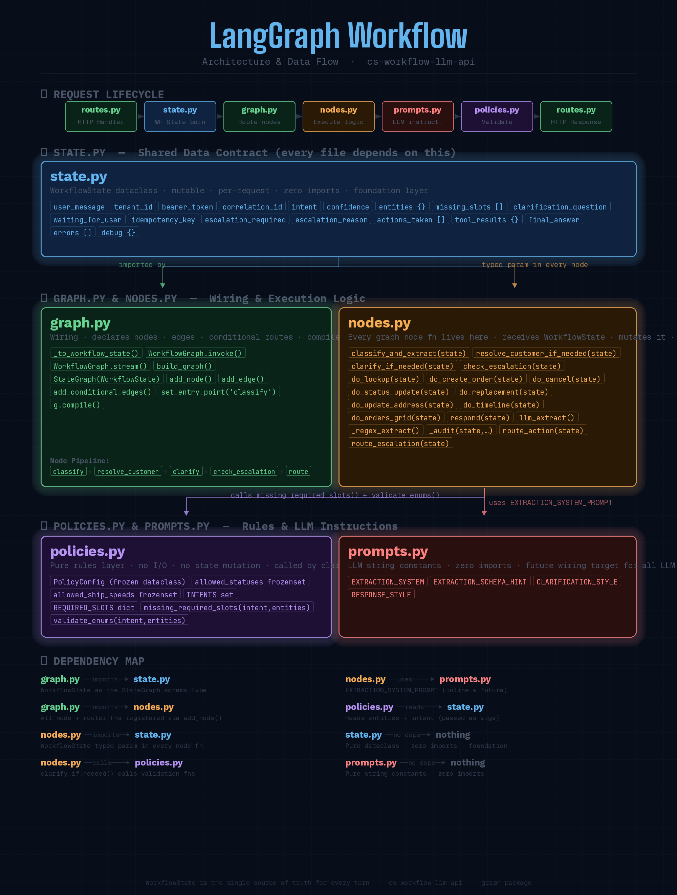
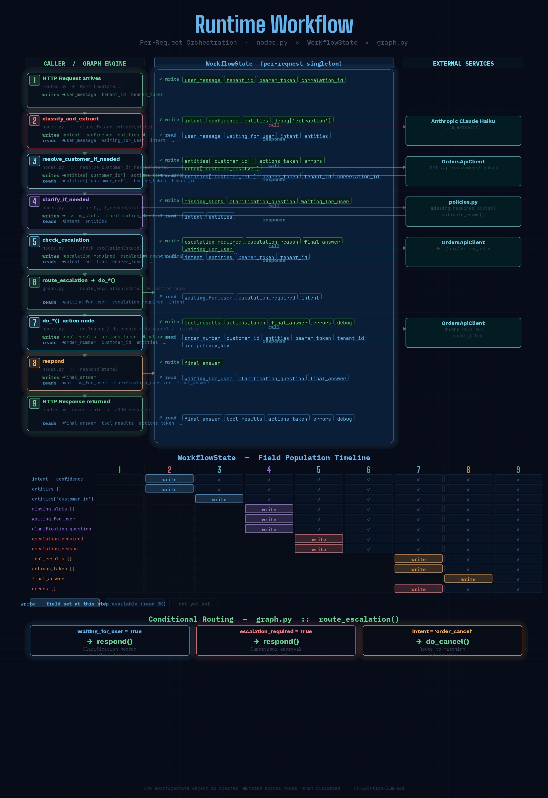

## What is a Dataclass in Python?

A dataclass is a Python class that is specifically designed to **hold data**. Instead of writing repetitive boilerplate code that every data-holding class needs, you decorate the class with `@dataclass` and Python generates that boilerplate for you automatically.

---

### The Problem It Solves

Without a dataclass, if you want a simple class to hold a person's name and age, you write this:

```python
class Person:
    def __init__(self, name: str, age: int):
        self.name = name
        self.age = age

    def __repr__(self):
        return f"Person(name={self.name!r}, age={self.age!r})"

    def __eq__(self, other):
        if not isinstance(other, Person):
            return NotImplemented
        return self.name == other.name and self.age == other.age
```

That is 12 lines for two fields. With a dataclass:

```python
from dataclasses import dataclass

@dataclass
class Person:
    name: str
    age: int
```

Four lines. Python generates `__init__`, `__repr__`, and `__eq__` for you automatically.

---

### What Python Generates Automatically

When you write `@dataclass`, Python reads your field declarations and generates four methods behind the scenes:

**`__init__`** — so you can construct the object with `Person(name="Alice", age=30)` without writing a constructor.

**`__repr__`** — so printing the object gives you `Person(name='Alice', age=30)` instead of `<__main__.Person object at 0x...>`.

**`__eq__`** — so `Person("Alice", 30) == Person("Alice", 30)` returns `True` by comparing field values rather than object identity.

**`__hash__`** — generated only under specific conditions (discussed below).

---

### Default Values

Fields can have default values, just like function arguments:

```python
@dataclass
class Person:
    name: str
    age: int
    country: str = "US"
    active: bool = True
```

Now `Person(name="Alice", age=30)` works and `country` defaults to `"US"`.

---

### `field()` for Mutable Defaults

This is where `WorkflowState` in the codebase you read uses `field(default_factory=dict)` and `field(default_factory=list)`. Here is why it exists.

In Python, you **cannot** use a mutable object like a list or dict as a default value directly:

```python
@dataclass
class BadExample:
    items: list = []  # This raises a ValueError
```

Python raises an error because if every instance shared the same list object as default, mutating one instance's list would mutate all of them — a classic Python gotcha. The `field()` function solves this by providing a **factory** — a callable that creates a fresh object for each instance:

```python
from dataclasses import dataclass, field

@dataclass
class GoodExample:
    items: list = field(default_factory=list)
    metadata: dict = field(default_factory=dict)
```

Now each instance gets its own fresh list and dict. This is exactly what `WorkflowState` does for `entities`, `errors`, `actions_taken`, `tool_results`, and `debug`.

---

### `frozen=True` — Immutable Dataclasses

Adding `frozen=True` makes the dataclass **immutable** — you cannot change any field after construction. Attempting to do so raises a `FrozenInstanceError`.

```python
@dataclass(frozen=True)
class PolicyConfig:
    allowed_statuses: frozenset = frozenset({"ACTIVE", "INACTIVE"})
```

This is exactly how `PolicyConfig` is used in `policies.py`. It is frozen because it is a configuration object that should never be mutated at runtime — making it immutable makes that guarantee enforced by Python itself rather than just by convention.

Frozen dataclasses also become **hashable** automatically, meaning they can be used as dictionary keys or stored in sets.

---

### Comparing `@dataclass` vs `frozen=True` in the Codebase

Looking at the two dataclasses you have already read:

```python
# state.py — mutable, because every node writes to it
@dataclass
class WorkflowState:
    intent: str = "unknown"
    entities: Dict[str, Any] = field(default_factory=dict)
    waiting_for_user: bool = False
    # ...

# policies.py — immutable, because it is config that should never change
@dataclass(frozen=True)
class PolicyConfig:
    allowed_statuses: Set[str] = frozenset({...})
    allowed_ship_speeds: Set[str] = frozenset({...})
```

`WorkflowState` is mutable because every single node in the graph reads it, modifies it, and returns it. `PolicyConfig` is frozen because it is a constants holder — there is no reason any code should ever change the allowed statuses at runtime.

---

### Other Useful Dataclass Options

Beyond `frozen`, the `@dataclass` decorator accepts several other parameters worth knowing:

`order=True` tells Python to also generate `__lt__`, `__le__`, `__gt__`, `__ge__` so you can sort instances by their fields in declaration order.

`eq=False` tells Python not to generate `__eq__`, useful when you want identity comparison instead of value comparison.

`repr=False` suppresses the generated `__repr__` if you want to write your own.

`slots=True` (Python 3.10+) generates `__slots__` automatically, making instances more memory-efficient and attribute access faster.

---

### Dataclass vs Named Tuple vs Plain Dict vs Pydantic

These four options all solve "I need to hold structured data" but with different trade-offs:

| | Dataclass | NamedTuple | Plain Dict | Pydantic Model |
|---|---|---|---|---|
| Type hints | Yes | Yes | No | Yes |
| Mutable | Yes (unless frozen) | No | Yes | Yes (unless frozen) |
| Auto `__init__` | Yes | Yes | N/A | Yes |
| Runtime validation | No | No | No | Yes |
| IDE autocomplete | Yes | Yes | No | Yes |
| Inheritance | Yes | Limited | No | Yes |
| Performance | Fast | Fast | Fastest | Slower |
| Best for | Internal data structures | Lightweight records | Dynamic/unknown keys | API boundaries, input validation |

The codebase uses plain dataclasses (not Pydantic) because `WorkflowState` is an **internal** object that never crosses an API boundary directly — it does not need runtime type validation, only a clear structure that the IDE and type checker can reason about. If `WorkflowState` were serialised to/from JSON at an API boundary, Pydantic would be the stronger choice.

---

### The One-Line Mental Model

A dataclass is a **regular Python class where you only describe the data and Python writes the plumbing**. Everything a class can do, a dataclass can do — inheritance, methods, properties, class variables. The only difference is that the constructor, equality check, and string representation are written for you based on the fields you declare.

# state.py



## Rntime State




`WorkflowState` is a single Python dataclass that acts as the **shared memory object passed through every node in the graph**. Every node reads from it, writes to it, and returns it. Nothing is stored anywhere else between nodes — this is the entire runtime state of one conversation turn.

---

### Session-level fields

```python
user_message:   str = ""
tenant_id:      int = 1
bearer_token:   str = ""
correlation_id: str = ""
```

These four fields represent the **inbound request context** that arrives from the caller (e.g. `routes.py`) at the start of each turn.

- `user_message` is the raw text the customer support agent typed. Every node that needs to know what the user said reads from here.
- `tenant_id` is the integer ID of the tenant making the request. It is forwarded on every outbound call to `cs-orders-api` so the API can scope its data correctly.
- `bearer_token` is the Keycloak JWT passed in from the frontend. It is forwarded as the `Authorization: Bearer` header on every API call. When this token expires, the orders API returns 401, which `_friendly_error()` maps to the `SESSION_EXPIRED_MARKER` sentinel.
- `correlation_id` is a request-scoped trace ID (typically a UUID generated by the caller) that is forwarded to the orders API and written into every audit log entry, allowing a full request to be traced across services.

These fields are described as "preserved across turns" because in a multi-turn clarifier conversation, the caller re-submits the full state object each time, including these identifiers, so they remain consistent throughout the session.

---

### Interpretation fields

```python
intent:     str   = "unknown"
confidence: float = 0.0
entities: Dict[str, Any] = field(default_factory=dict)
```

These are written by `classify_and_extract()` on every turn.

- `intent` holds the classified intent string, one of the nine values defined in `policies.py`'s `INTENTS` set (`order_create`, `order_lookup`, etc., or `unknown`). Every downstream router and action node branches on this value.
- `confidence` is a float between 0.0 and 1.0 returned by the LLM representing how certain it is about the classified intent. It is stored here but not currently used for routing — it is written to `debug` for observability.
- `entities` is a flat dictionary of everything the LLM (or regex fallback) extracted from the message: things like `order_number`, `customer_id`, `lines`, `ship_to`, `status`, `ship_speed`, `reason`, etc. The keys align exactly with the request DTOs that `cs-orders-api` expects. Nodes like `resolve_customer_if_needed` and `_resolve_ship_to_if_needed` also write back into this dict (e.g. adding `customer_id` after resolving a `customer_ref`, or adding `ship_to_address_id` after resolving a raw address).

---

### Slot-filling / clarification fields

```python
missing_slots:          List[str]     = field(default_factory=list)
clarification_question: Optional[str] = None
waiting_for_user:       bool          = False
```

These are written by `clarify_if_needed()` and read by `route_action()` and `respond()`.

- `missing_slots` is a list of entity key names that are required for the current intent but were not extracted. It is populated by `missing_required_slots()` from `policies.py`. For example, for `order_cancel` with no order number, this would be `["order_number"]`.
- `clarification_question` is the human-readable question string that should be shown to the user when slots are missing. It is built by `build_clarification_question()` and eventually surfaced by `respond()` as `final_answer`.
- `waiting_for_user` is the critical boolean gate that controls the entire flow. When `True`, `route_action()` returns `"respond"` immediately, short-circuiting all action nodes. When `False`, the graph proceeds to the appropriate action node. It is set to `True` by `clarify_if_needed()` when slots are missing, by `check_escalation()` when a policy blocks the action, and by several error handlers (e.g. when a customer reference cannot be resolved). It is set back to `False` once all slots are filled on a subsequent turn.

---

### Idempotency field

```python
idempotency_key: Optional[str] = None
```

This is used exclusively by `do_create_order()`. The first time an `order_create` intent reaches that node, it generates a UUID and stores it here. On any subsequent retry of the same request (e.g. if the user re-submits after a network error mid-clarification), the same key is reused. `cs-orders-api` uses this key to detect duplicate create requests and return the cached response instead of creating a second order.

---

### Escalation fields

```python
escalation_required: bool          = False
escalation_reason:   Optional[str] = None
```

These are written by `check_escalation()`.

- `escalation_required` is set to `True` when a policy rule blocks the action — for example, when an agent attempts an OVERNIGHT replacement and the `ALLOW_OVERNIGHT_FOR_REPLACEMENT` policy rule has `allowed: false`, or when the replacement order total exceeds the policy's `max_order_total` threshold.
- `escalation_reason` holds the human-readable explanation of why the escalation was triggered, which is embedded directly into `final_answer` and shown to the agent with a ⚠️ prefix. The `route_escalation()` router checks `escalation_required` to decide whether to skip action nodes and jump straight to `respond()`.

---

### Tool execution trace fields

```python
actions_taken: List[Dict[str, Any]] = field(default_factory=list)
tool_results:  Dict[str, Any]       = field(default_factory=dict)
```

These accumulate a record of everything the graph did during a turn.

- `actions_taken` is a list of dicts, where each entry records one API call that was made — the action name, the key parameters (e.g. `order_number`, `status`), and optionally an outcome like `"ERROR"`. It is appended to by every action node and by `resolve_customer_if_needed` and `_resolve_ship_to_if_needed`. The caller (the API response) receives this list so it can show the agent exactly what was executed.
- `tool_results` is a dict keyed by action name (e.g. `"order"`, `"cancel"`, `"timeline"`) containing the raw response payload returned by `cs-orders-api`. The caller uses these to render the full order data, timeline events, and so on in the UI.

---

### Output fields

```python
final_answer: str                  = ""
errors:       List[Dict[str, Any]] = field(default_factory=list)
```

- `final_answer` is the string that gets returned to the user. It is set by every action node on both success and failure, by `check_escalation()` on policy blocks, by `resolve_customer_if_needed()` on customer lookup failures, and finally by `respond()` as a fallback. The `respond()` node is always the last node in the graph, and whatever is in `final_answer` at that point is what the API returns.
- `errors` is a list of dicts recording every failure that occurred during the turn — API errors, validation errors, address resolution failures, etc. Each dict typically contains the action name, HTTP status code, and raw error payload. This is included in the API response for debugging and audit purposes.

---

### Debug field

```python
debug: Dict[str, Any] = field(default_factory=dict)
```

`debug` is a free-form dict that every node can write into under its own namespaced key (e.g. `debug["extraction"]`, `debug["escalation"]`, `debug["address_resolve"]`). It is never shown to the end user but is included in the API response body for developers. It captures things like which extraction mode was used (LLM vs regex fallback), what the LLM returned before normalisation, what policy rules were fetched, what address ID was resolved, and any exceptions that were caught and handled. It is the primary observability surface for understanding exactly what happened inside a turn without needing to attach a debugger.